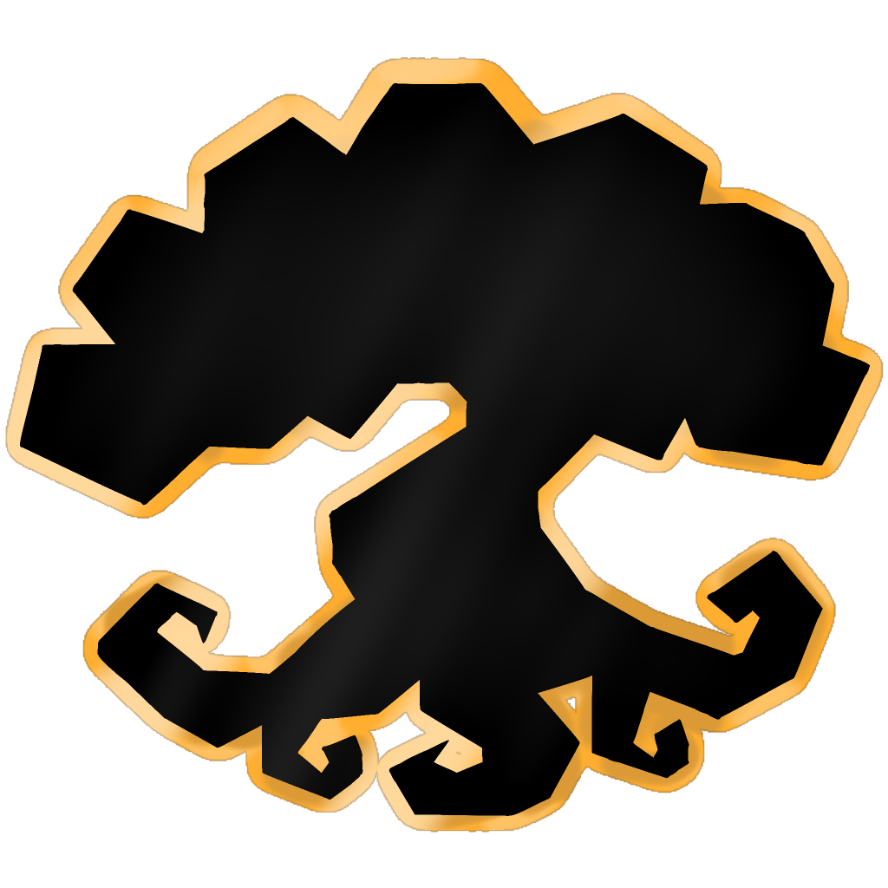

<a id="readme-top"></a>
<!-- PROJECT SHIELDS -->
<!--
*** I'm using markdown "reference style" links for readability.
*** Reference links are enclosed in brackets [ ] instead of parentheses ( ).
*** See the bottom of this document for the declaration of the reference variables
*** for contributors-url, forks-url, etc. This is an optional, concise syntax you may use.
*** https://www.markdownguide.org/basic-syntax/#reference-style-links
-->
[![Contributors][contributors-shield]][contributors-url]
[![Forks][forks-shield]][forks-url]
[![Stargazers][stars-shield]][stars-url]
[![Issues][issues-shield]][issues-url]
[![AGPL-3.0 License][license-shield]][license-url]


<!-- PROJECT LOGO -->
<br />
<div align="center">
  <a href="https://github.com/raisingkaines/FreeRealms-Legacy">
    
  </a>

<h3 align="center">FreeRealms Legacy</h3>

  <p align="center">
    An open-source server emulator for Free Realms built from scratch in C# and .NET.
    <br />
    <a href="https://github.com/raisingkaines/FreeRealms-Legacy/wiki"><strong>Explore the docs »</strong></a>
    <br />
    <br />
    <a href="https://github.com/raisingkaines/FreeRealms-Legacy">View Demo</a>
    ·
    <a href="https://github.com/raisingkaines/FreeRealms-Legacy/issues/new?labels=bug&template=bug-report---.md">Report Bug</a>
    ·
    <a href="https://github.com/raisingkaines/FreeRealms-Legacy/issues/new?labels=enhancement&template=feature-request---.md">Request Feature</a>
  </p>
</div>


<!-- TABLE OF CONTENTS -->
<details>
  <summary>Table of Contents</summary>
  <ol>
    <li>
      <a href="#about-the-project">About The Project</a>
      <ul>
        <li><a href="#key-features">Key Features</a></li>
        <li><a href="#architecture-overview">Architecture Overview</a></li>
        <li><a href="#built-with">Built With</a></li>
      </ul>
    </li>
    <li>
      <a href="#getting-started">Getting Started</a>
      <ul>
        <li><a href="#prerequisites">Prerequisites</a></li>
        <li><a href="#installation">Installation</a></li>
      </ul>
    </li>
    <li><a href="#usage">Usage</a></li>
    <li><a href="#roadmap">Roadmap</a></li>
    <li><a href="#contributing">Contributing</a></li>
    <li><a href="#license">License</a></li>
    <li><a href="#contact">Contact</a></li>
    <li><a href="#acknowledgments">Acknowledgments</a></li>
  </ol>
</details>


<!-- ABOUT THE PROJECT -->
## About The Project

[![Product Name Screen Shot][product-screenshot]](https://github.com/raisingkaines/FreeRealms-Legacy)

**FreeRealms Legacy** is an open-source server emulator for Sony Online Entertainment's beloved family MMORPG, *Free Realms*, written from the ground up in modern C# and .NET.

The mission of this project is game preservation: reverse-engineering the original client-server protocols and recreating a complete, accurate server implementation so players and developers can explore and experience the world of Sacred Grove once again.

### Key Features
* **Full Network Stack**: Built on a custom high-performance UDP networking layer (`Sanctuary.UdpLibrary`) matching the original SOE reliable UDP protocol.
* **Modular Microservice Architecture**: Cleanly decoupled services for Gateway, Login, World Game Server, and Web API.
* **Multi-Database Support**: Entity Framework Core data layer supporting both SQLite (for lightweight local testing) and MySQL (for production server deployments).
* **Dynamic Lua Scripting**: Scriptable NPCs, quests, dialogue systems, and zone events powered by an embedded Lua scripting engine.
* **Preservation Focus**: Support for character creation, customizable clothing & gear, chat channels, minigames, and world zoning transitions.

### Architecture Overview
* **`Sanctuary.Core`** — Shared models, protocol definitions, packet contracts, and core utility classes.
* **`Sanctuary.Login`** — Handles player authentication, account registration, character selection, and gateway dispatch tokens.
* **`Sanctuary.Gateway`** — Manages client UDP network sessions, packet encryption, compression, and sub-packet routing.
* **`Sanctuary.Game`** — World simulation engine handling players, NPC spawning, movement updates, item inventories, chat, and rewards.
* **`Sanctuary.Database`** — Entity Framework Core database models with dedicated SQLite and MySQL providers.
* **`Sanctuary.WebAPI`** — RESTful HTTP services for character portrait uploads, account verification, and launcher integration.
* **`Sanctuary.Scripting`** — Lua-based scripting engine providing flexible NPC behaviors and zone interaction scripts.
* **`Sanctuary.UdpLibrary`** — High-performance, cross-platform reliable UDP transport with channel multiplexing and packet bundling.

<p align="right">(<a href="#readme-top">back to top</a>)</p>


### Built With

* [![CSharp][CSharp]][CSharp-url]

<p align="right">(<a href="#readme-top">back to top</a>)</p>


<!-- GETTING STARTED -->
## Getting Started

This repository only contains the **server emulator** for Free Realms. To play the game, you must also have a **Free Realms client**. You can download the client using the **FreeRealms Legacy Launcher**.

### Prerequisites

Before you can use this software, ensure you have the following installed:

- **[.NET 10 SDK](https://dotnet.microsoft.com/download/dotnet/10.0)**  
  Needed to build the solution. `src/global.json` asks for version 10.0.100 or a later 10.0 release.
- **[.NET 9 Runtime and ASP.NET Core 9 Runtime](https://dotnet.microsoft.com/download/dotnet/9.0)**  
  Needed to run the servers, which target .NET 9. The .NET 10 SDK does not include them.
- **Visual Studio 2026** (optional)  
  The steps below use Visual Studio, but you can also build from a terminal by running `dotnet build` in the `src` folder. Visual Studio 2022 cannot load current .NET 10 SDKs.

### Release

1. Clone the repo
   ```sh
   git clone https://github.com/raisingkaines/FreeRealms-Legacy.git
   ```
2. Build the solution for `Sanctuary.Core` for `Release`
3. Create a file named `database.json` next to `Sanctuary.Login.exe` in its `bin\Release\net9.0` output folder, and another next to `Sanctuary.Gateway.exe`
4. Paste the following
   ```json
    {
    "Database": {
        "Provider": "Sqlite",
        "ConnectionString": "Data Source=D:\\Games\\Free Realms\\sanctuary.db;"
    }
    }
   ```
5. Create a file named `appsettings.Production.json` next to `Sanctuary.WebAPI.exe` with the same contents. The Web API needs its own copy because it does not read `database.json`
6. Launch `Sanctuary.Login` first so that it can create the database, then `Sanctuary.Gateway` and `Sanctuary.WebAPI`. Start each server from its own output folder, since they load their `Resources` folder from the folder you start them in
7. Connect to the client

**_IMPORTANT:_** Update the Data Source file path (D:\\Games\\Free Realms\\sanctuary.db) to match the location where your database files are stored.

**_NOTE:_** A new database contains no accounts. Accounts are created through the Web API's `/register` endpoint; usernames are 3-50 characters long and passwords at least 6. To turn an account into an admin account, set the flag in the database and log in again:

```sql
UPDATE Users SET IsAdmin = 1 WHERE Username = 'your_username';
```

<p align="right">(<a href="#readme-top">back to top</a>)</p>

### Debug

1. Clone the repo
   ```sh
   git clone https://github.com/raisingkaines/FreeRealms-Legacy.git
   ```
2. Build the solution for `Sanctuary.Core` for `Debug`
3. Right-Click **'Manage User Secrets'** on `Sanctuary.Login`. Every server project shares the same secrets file, so this covers `Sanctuary.Gateway` and `Sanctuary.WebAPI` as well

4. Copy and paste the following configuration for **SQLite** into the secrets editor:

   ```json
   {
     "Database": {
       "Provider": "Sqlite",
       "ConnectionString": "Data Source=D:\\Games\\Free Realms\\sanctuary.db;"
     }
   }
   ```
5. Launch `Sanctuary.Login`, `Sanctuary.Gateway` and `Sanctuary.WebAPI`
6. Connect to the client

**_IMPORTANT:_** Update the Data Source file path (D:\\Games\\Free Realms\\sanctuary.db) to match the location where your database files are stored.

<p align="right">(<a href="#readme-top">back to top</a>)</p>

### Docker Compose

1. Clone the repo
   ```sh
   git clone https://github.com/raisingkaines/FreeRealms-Legacy.git
   ```
2. Launch `Docker Compose`
3. Connect to the client

<p align="right">(<a href="#readme-top">back to top</a>)</p>

<!-- USAGE EXAMPLES -->
## Usage

To spawn an npc ```/npc spawn <NameId> <ModelId> [TextureAlias]``` TextureAlias is optional

_For more examples, please refer to the [Documentation](https://github.com/raisingkaines/FreeRealms-Legacy/wiki)_

<p align="right">(<a href="#readme-top">back to top</a>)</p>


<!-- ROADMAP -->
## Roadmap

- [ ] Feature 1
- [ ] Feature 2
- [ ] Feature 3
    - [ ] Nested Feature

See the [open issues](https://github.com/raisingkaines/FreeRealms-Legacy/issues) for a full list of proposed features (and known issues).

<p align="right">(<a href="#readme-top">back to top</a>)</p>


<!-- CONTRIBUTING -->
## Contributing

Contributions are what make the open source community such an amazing place to learn, inspire, and create. Any contributions you make are **greatly appreciated**.

If you have a suggestion that would make this better, please fork the repo and create a pull request. You can also simply open an issue with the tag "enhancement".
Don't forget to give the project a star! Thanks again!

1. Fork the Project
2. Create your Feature Branch (`git checkout -b feature/AmazingFeature`)
3. Commit your Changes (`git commit -m 'Add some AmazingFeature'`)
4. Push to the Branch (`git push origin feature/AmazingFeature`)
5. Open a Pull Request

<p align="right">(<a href="#readme-top">back to top</a>)</p>

### Top contributors:

<a href="https://github.com/raisingkaines/FreeRealms-Legacy/graphs/contributors">
  
</a>


<!-- LICENSE -->
## License

Distributed under the GNU Affero General Public License v3.0. See [`LICENSE`](LICENSE) for more information.

<p align="right">(<a href="#readme-top">back to top</a>)</p>


<!-- CONTACT -->
<!-- ## Contact

Your Name - [@twitter_handle](https://twitter.com/twitter_handle) - email@email_client.com

Project Link: [https://github.com/raisingkaines/FreeRealms-Legacy](https://github.com/raisingkaines/FreeRealms-Legacy)

<p align="right">(<a href="#readme-top">back to top</a>)</p> -->


<!-- ACKNOWLEDGMENTS -->
## Acknowledgments

* []()
* []()
* []()

<p align="right">(<a href="#readme-top">back to top</a>)</p>


<!-- MARKDOWN LINKS & IMAGES -->
<!-- https://www.markdownguide.org/basic-syntax/#reference-style-links -->
[contributors-shield]: https://img.shields.io/github/contributors/raisingkaines/FreeRealms-Legacy.svg?style=for-the-badge
[contributors-url]: https://github.com/raisingkaines/FreeRealms-Legacy/graphs/contributors
[forks-shield]: https://img.shields.io/github/forks/raisingkaines/FreeRealms-Legacy.svg?style=for-the-badge
[forks-url]: https://github.com/raisingkaines/FreeRealms-Legacy/network/members
[stars-shield]: https://img.shields.io/github/stars/raisingkaines/FreeRealms-Legacy.svg?style=for-the-badge
[stars-url]: https://github.com/raisingkaines/FreeRealms-Legacy/stargazers
[issues-shield]: https://img.shields.io/github/issues/raisingkaines/FreeRealms-Legacy.svg?style=for-the-badge
[issues-url]: https://github.com/raisingkaines/FreeRealms-Legacy/issues
[license-shield]: https://img.shields.io/github/license/raisingkaines/FreeRealms-Legacy.svg?style=for-the-badge
[license-url]: https://github.com/raisingkaines/FreeRealms-Legacy/blob/main/LICENSE
[linkedin-shield]: https://img.shields.io/badge/-LinkedIn-black.svg?style=for-the-badge&logo=linkedin&colorB=555
[linkedin-url]: https://linkedin.com/in/linkedin_username
[product-screenshot]: images/screenshot.jpg
[CSharp]: https://img.shields.io/badge/csharp-000000?style=for-the-badge&logo=csharp&logoColor=white
[CSharp-url]: https://dotnet.microsoft.com/en-us/languages/csharp
